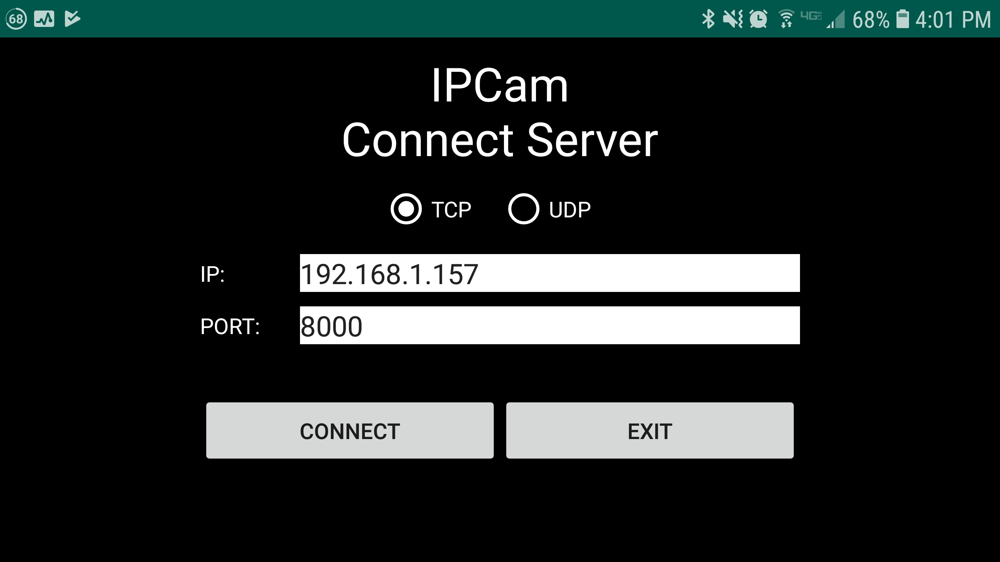
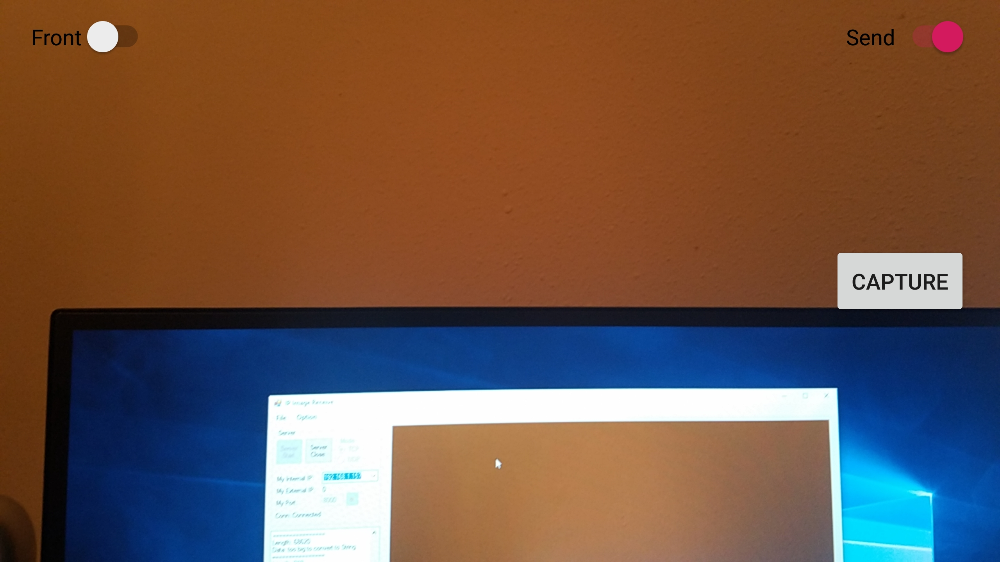

# Android-IP-Cam-Sender

This application is able to work with [the project titled CSharp-IP-Cam-Receiver](https://github.com/kkbw1/CSharp-IP-Cam-Receiver) in my repository.  

Originally written in Eclipse IDE and re-made in Android Studio IDE.  

Development IDE: Android Studio  
Language: Java  

Connection Part UI Captured Image:  
  
  
Streaming Part UI Captured Image:
    
